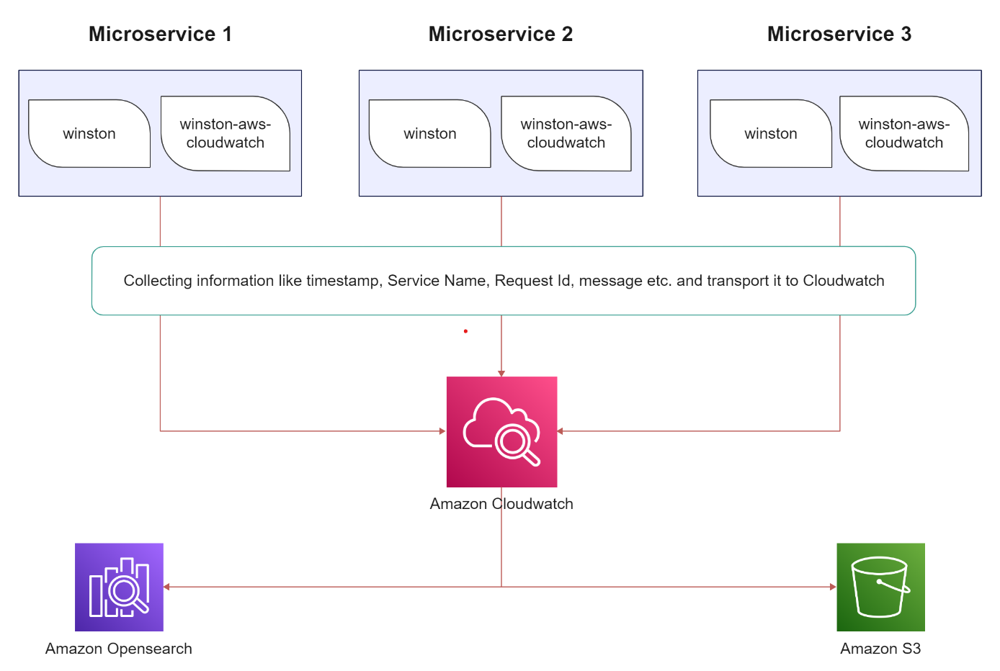

## Introdution

### Main Idea

Process Flow:

- Individual services will generate logs using **winston** and transport to AWS CloudWatch using **winston-aws-cloudwatch**.
- **Cls-rtracer** will be used for generating unique ID for logs for every request.
- CloudWatch will Stream the logs to AWS OpenSearch (Successor to Elastic Search Service).
- Logs will be viewed and queried using openSearch Dashboard (Kibana).
- Archive log to S3 each day from CloudWatch.
  

## Installation

Add `npm.pkg.github.com` registry by create a file and named `.npmrc`:

```
@finhay:registry=https://npm.pkg.github.com
//npm.pkg.github.com/:_authToken=GITHUB_PERSONAL_TOKEN
registry=https://registry.npmjs.org/
```

```javascript
npm i @finhay/winston-cw-logger
```

Required ENV variables:

- LOG_GROUP_NAME: group name (default "unnamed-log-group")
- CW_AWS_ACCESS_KEY_ID: access key id (have access to cloudwatch)
- CW_AWS_SECRET_ACCESS_KEY: secret access key (have access to cloudwatch)
- AWS_REGION: default "ap-southeast-1"

## Usage:

Log a text message:

```javascript
const { logger } = require('@finhay/winston-cw-logger');

logger.info("This is test message");
```

To log a message contains an object:

```javascript
logger.info("Log object %o %s", { a: 1, b: 2 }, "extra text");
```

#### Referrence

[Logging in Microservice Architecture](https://www.linkedin.com/pulse/logging-microservice-architecture-alumnus-software-limited-1c)
